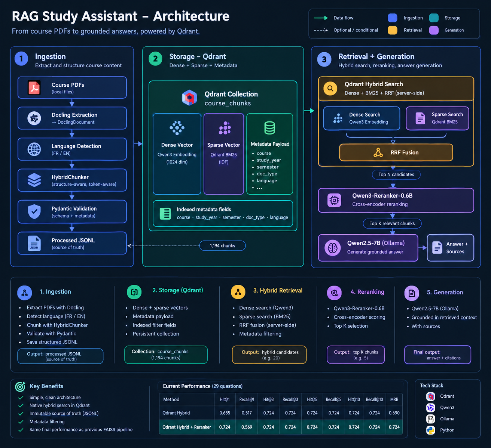

# RAG Study Assistant

A grounded **Retrieval-Augmented Generation (RAG)** study assistant for university course material.

The system ingests course PDFs, extracts and structures their content, stores dense and sparse representations in **Qdrant**, retrieves relevant content using hybrid search, reranks the candidates, and generates answers grounded in the available course material.

The knowledge base currently contains primarily **French** course material, with support for **English** documents. It is being expanded across multiple courses, semesters, and study years.

---

## Architecture

<p align="center">
  
</p>

The system follows a simple pipeline: course PDFs are extracted and chunked with Docling, stored in Qdrant with dense and sparse representations plus metadata, retrieved through hybrid search and RRF, reranked with Qwen3-Reranker, and finally used by the LLM to generate a grounded answer with sources.

## Current Status

The project has progressed from an initial RAG MVP to a structured, evaluated retrieval system.

### Ingestion

* PDF extraction with **Docling**
* Structure-aware, token-aware chunking with **Docling HybridChunker**
* Pydantic-based chunk validation
* Automatic **French/English language detection**
* Metadata for course, study year, semester, lecture, document type, source file, page range, and section
* Incremental ingestion using **SHA-256 document IDs**
* Deterministic chunk IDs
* Processed JSONL retained as the canonical source of knowledge

### Retrieval

* Dense embeddings with **Qwen3-Embedding-0.6B**
* **Qdrant** vector database
* Native dense + sparse hybrid retrieval
* Sparse retrieval using **Qdrant BM25**
* **Reciprocal Rank Fusion (RRF)** performed by Qdrant
* Metadata filtering through Qdrant payloads
* **Qwen3-Reranker-0.6B** cross-encoder reranking

### Generation

* Local LLM generation with **Ollama**
* **Qwen2.5-7B**

### Engineering

* Centralized configuration through `config.yaml`
* Separation between ingestion, storage, retrieval, reranking, and generation
* Persistent loading of embedding and reranking models within the application process
* Basic retrieval unit tests with `pytest`
* Retrieval evaluation dataset with manually verified relevant chunk IDs

---

## Repository Structure

```text
rag-study-assistant/
├── config.yaml
├── data/
│   ├── raw/                 # Source PDFs (gitignored)
│   └── processed/           # Validated chunks / source of truth (gitignored)
├── evaluation/
│   ├── questions.json       # Retrieval evaluation dataset
│   └── evaluate.py          # Retrieval evaluation
├── scripts/
│   ├── index_qdrant.py      # Build Qdrant index from processed JSONL
│   └── check_qdrant.py      # Qdrant health / collection check
├── src/
│   ├── config.py            # Central configuration
│   ├── schemas.py           # Pydantic data models
│   ├── ingest.py            # PDF ingestion and chunking
│   ├── language.py          # Language detection
│   ├── embed.py             # Embedding model
│   ├── qdrant_storage.py    # Qdrant storage + hybrid search
│   ├── retrieve.py          # Application retrieval API
│   ├── reranker.py          # Cross-encoder reranking
│   └── generate.py          # LLM generation
├── tests/
│   └── test_retrieval.py    # Retrieval unit tests
└── notebooks/
```

Each module has a focused responsibility without introducing unnecessary abstraction for the current project scale.

---

## Ingestion and Chunking

The current ingestion pipeline is:

```text
PDF
 ↓
DoclingDocument
 ↓
Language detection
 ↓
HybridChunker
 ↓
Metadata enrichment
 ↓
Pydantic validation
 ↓
JSONL
```

The previous page-based `RecursiveCharacterTextSplitter` approach was replaced with **Docling HybridChunker** to better preserve document structure and semantic coherence.

The current chunk schema includes:

```json
{
  "id": "...",
  "document_id": "...",
  "text": "...",
  "course": "java",
  "study_year": "1dni",
  "semester": "S2",
  "lecture": "Chapitre 5 - Les exceptions",
  "doc_type": "lecture",
  "language": "fr",
  "source_file": "lecture5-les-exceptions.pdf",
  "page_start": 27,
  "page_end": 28,
  "section": "Exceptions > Gestion des erreurs",
  "chunk_index": 8
}
```

Language is detected from the extracted document content rather than encoded in the directory structure.

Document identity is based on the SHA-256 hash of the PDF content. Chunk IDs are deterministic and remain attached to the chunk throughout ingestion, storage, retrieval, reranking, and source tracing.

Processed JSONL files remain the **source of truth** and can be used to rebuild the Qdrant index.

---

## Knowledge Base

The current Qdrant collection is:

```text
course_chunks
```

The current indexed corpus contains **1,194 chunks**.

Each Qdrant point contains:

```text
Point
├── ID
├── Dense vector
├── Sparse BM25 vector
└── Payload
    ├── text
    ├── course
    ├── study_year
    ├── semester
    ├── lecture
    ├── doc_type
    ├── language
    ├── source_file
    ├── page_start
    ├── page_end
    ├── section
    ├── chunk_index
    └── document_id
```

Qdrant also provides indexed metadata fields used for optional filtering, such as:

```text
course
study_year
semester
doc_type
language
```

Filtering is optional. A normal natural-language query can search the full knowledge base, while the application can provide structured filters when the course or semester is known.

---

## Retrieval

The production retrieval pipeline is now:

```text
User query
    │
    ▼
Qdrant
 ├── Dense search
 ├── Qdrant BM25
 └── RRF
    │
    ▼
Hybrid candidates
    │
    ▼
Qwen3-Reranker-0.6B
    │
    ▼
Top-K chunks
```

The application-level API remains simple:

```python
results = retrieve(query)
```

An optional metadata filter can also be supplied:

```python
results = retrieve(
    query,
    metadata_filter={
        "course": "communication-numerique",
        "semester": "S1"
    }
)
```

The metadata filter is an application-level parameter; students do not need to write structured expressions such as `course=...` in their questions.

---

## Configuration

Models and tunable parameters are centralized in `config.yaml`.

```yaml
embedding:
  model: "Qwen/Qwen3-Embedding-0.6B"
  dimension: 1024

generation:
  provider: "ollama"
  model: "qwen2.5:7b"

chunking:
  chunk_size_tokens: 500

paths:
  raw_dir: "data/raw"
  processed_dir: "data/processed"

retrieval:
  top_k: 5
  candidate_k: 20

reranker:
  model: "Qwen/Qwen3-Reranker-0.6B"

qdrant:
  url: "http://localhost:6333"
  collection: "course_chunks"
```

This allows model and retrieval experiments without modifying the core application code.

---

## Evaluation

A manually curated retrieval evaluation dataset is used to measure retrieval quality objectively.

The current dataset contains **29 questions** with manually verified relevant chunk IDs.

Evaluation metrics:

* Hit@K
* Recall@K
* MRR

### Current Qdrant benchmark

Current results on the 29-question dataset:

| Retrieval stage          |     Hit@1 |  Recall@1 |     Hit@3 |  Recall@3 |     Hit@5 |  Recall@5 |    Hit@10 | Recall@10 |       MRR |
| ------------------------ | --------: | --------: | --------: | --------: | --------: | --------: | --------: | --------: | --------: |
| Qdrant Hybrid            |     0.655 |     0.517 |     0.724 |     0.724 |     0.724 |     0.724 |     0.724 |     0.724 |     0.690 |
| Qdrant Hybrid + Reranker | **0.724** | **0.569** | **0.724** | **0.724** | **0.724** | **0.724** | **0.724** | **0.724** | **0.724** |

The reranker therefore improves the current top-rank retrieval metrics, while Recall@5 and Recall@10 remain unchanged on this evaluation set.

### FAISS migration baseline

Before the Qdrant migration, the previous FAISS + BM25 + RRF + reranker pipeline achieved:

```text
Hit@1     0.724
Recall@1  0.569
Recall@5  0.724
MRR       0.724
```

The new Qdrant hybrid + reranker pipeline reaches the same final metrics on the current evaluation dataset.

This provided the baseline validation for replacing the local FAISS/BM25 storage layer with Qdrant.

---

## Testing

Basic retrieval unit tests are implemented with `pytest`.

Current tests cover:

* Reciprocal Rank Fusion behavior from the previous retrieval implementation
* Preservation of retrieved documents
* Retrieval pipeline component interactions

Run:

```bash
pytest tests/test_retrieval.py -v
```

Current status:

```text
3 passed
```

The retrieval evaluation is kept separate from unit tests because unit tests validate application logic, while the evaluation dataset measures retrieval quality against the actual course corpus.

---

## Local Qdrant Setup

Qdrant is currently run locally with Docker.

The application connects to:

```text
http://localhost:6333
```

The Qdrant dashboard is available at:

```text
http://localhost:6333/dashboard
```

The Qdrant data is persisted using a Docker volume so the collection survives container restarts.

The processed JSONL corpus remains independent of Qdrant and can be used to rebuild the database.

---

## Design Principles

* **Grounded generation:** answers should rely on retrieved course material.
* **Structure-aware chunking:** preserve meaningful document structure rather than relying only on page boundaries.
* **Hybrid retrieval:** combine semantic and lexical signals.
* **Reranking:** use a stronger cross-encoder to improve candidate ordering.
* **Reproducibility:** use deterministic document and chunk identities where appropriate.
* **Configuration over hardcoding:** models and tunable parameters live in `config.yaml`.
* **Separation of concerns:** ingestion, storage, retrieval, reranking, and generation remain independent components.
* **Evaluation-driven development:** retrieval changes are measured using a fixed ground-truth dataset.
* **Incremental complexity:** introduce infrastructure only when the project requires it.
* **Source of truth:** processed JSONL remains rebuildable source data; Qdrant is the searchable index.
---
Course PDFs and generated indexes are kept out of version control because they are local/derived data and may contain copyrighted teaching material.
